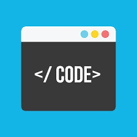

*There is a right tool for everything, but no tool is right for everything*

## A better hammer
Semantic UI is a pain to learn in the beginning, there are just a lot of different and small minute details that you have to keep in mind for every part of the UI you work on. Though I believe that this is in case of HTML and CSS a very useful tool. This is very comparable to learning how to use the functions in the libraries that can be used in other languages like C and Java. Both libraries of functions and Semantic UI have this wall of learning that you must overcome. But after learning this significantly useful tool, coding more complicated programs and sites becomes easier with every bit of this tool that you can learn. Just like if you were to use a hammer to break down a chunk of rock, it can be done, you can use a jackhammer to break down the rock faster. Just knowing how to use this tool can be helpful in many different ways.

## Drawbacks with jackhammer
As I said before, the tools given like the semantic UI are like jackhammers if your coding was a normal hammer. These tools are helpful but there are some problems that come with this. Such as when making a menu at the top of the site, it can be done with the semantic UI. Making a general top menu is easy with this, but the fine tuning to what you want it to look like is the hard part. Like jackhammer to a small hammer, you can’t really do the fine tunings in the way you want to because some of the semantic UI is already done the fine tuning for you which makes it hard for you to control if you don’t understand fully on how these semantic UI works. Sure there are some parts of the semantic UI that does make the even finer tuning than just the normal HTML but the point is that there are some problems with control of the aesthetic when it comes to pre built models. Especially when you want a specific way your site to look like, such as having an mp4 running as a background instead of a picture, but semantic UI doesn’t care as long as it has what it wants done. This can be overridden if you know how to, but blindly learning how to use semantic UI on top of HTMl does not help with the already built on confusion from the preset look to the site.
