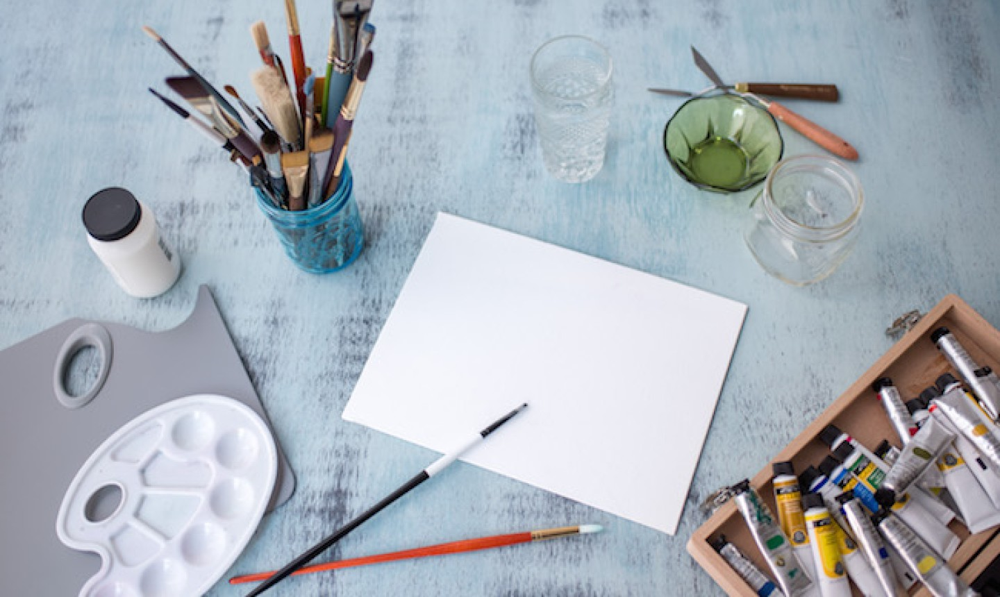

*”I found I could say things with color and shapes that I couldn’t say any other way-things I had no words for.” - Georgia O’Keeffe*

## Preparation for the painting

Preparing to make an art piece is much like preparing to start a coding project. Where you can have millions of ideas floating around in your head of what to make, but you have to first prepare a canvas, the tools, and the material to start any art at all. For coding much of the same process, where a canvas be the computer or the files written on, tools such as the programs to write the programs, the material being the languages able to be used for each of those programs you use. Even in preparation for creating such art is the same in both art and coding. You need some idea to work towards, create a rough draft of the product, then create the product itself. And in the process of creating such art, like all artists, starts to create patterns in their design as more is being made by these artists. 

## Personal Painting Patterns

Over time, as more different products are being made, a pattern starts to appear in their work. In art pieces, some quirk from their technique or their representation as a whole makes it different from any other artists work. Same with coding, like my own personal projects ever since I have started to do recent work. Before, these patterns weren’t there, just a new person still trying to get a hang of the use of the tools, how to create a new canvas, and learning how the language reacted to other materials. Then patterns start to appear, in the code with more structure, organized functions, specifications of each section, with a better flow. Similar to many other ‘artists’, but slight differences from others nonetheless. And the visual projects, similar to any art, with my own designs, similar to other programmers and their design, but with a little difference in how the code has been made. Though most prominently, the problem solutions. Where each little part of the projects produce a problem, how it is solved becomes different to each programmer, how some will be direct, some will solve in indirect roundabout ways, and my problem solving will take in account in how the solution may affect another part of the code to prevent any other problems or tackling multiple at once. These are the patterns that start to show when an artist starts a painting, as well as a programmer starting a project.

