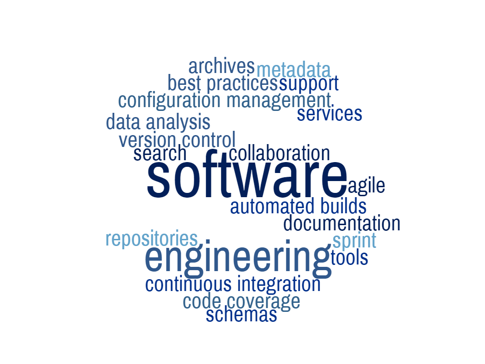

*"Reflection is one of the most underused yet powerful tools for success" -Richard Carlson*

## More than just software engineering

Throughout the semester, I learned many different aspects of web application development. From different languages such as javascript to HTML, to different tools for the craft such as meteor and mongoDB. There were many different insights in how most websites were built, into how other more advanced programming tools were made for more recent web design. Though being able to use and know about these tools were just a single part of the whole class. There were much more topics covered throughout the course.  

## Not just functional

One of the major topics covered was that for projects and assignments that has to deal with users, such as web applications, require a deeper thought on UI design. Not only the application must be functional to a accomplish a certain task, the user must be able to freely use the website as a tool to accomplish that task. Like a hammer, you can use a tool like a hammer, to hammer in nails, but it would be harder to use if the handle was placed at the front of the head of the hammer. Like all items that are to be used, it has to keep in mind that all people are able to use it with ease. 

## Different isn't always better

When designing for some project, being different with style is important to give yourself some unique flair. Though during coding, having a style and keeping a neat and tidy code goes a long way, especially in terms of group projects. Having a style of your own establishes a way to understand how you personally made your program. Being able to keep a style of your own also gives others insight in how to tackle a problem and vice versa. Just like style, having a standard or some structure is something important. Making a code able to be read easily at a glance creates an ease for others to understand your work or even to yourself after a while. Without some structure or description, the code becomes harder to understand and becomes harder to remember what the code was suppose to do down the line of creating larger projects. To give some ease to both yourself and others, being able to keep some structure, style, and simplicity in your code becomes an important factor for programs overall.

## There is no I in teamwork

One of the most important topic this course covered was that group projects aren't as easy as they seem when it comes to programming a group project. At a glance it may seem easy to just break the projects into parts to make, but as the work progresses, more and more problems starts to show. One of which is to make code that can coherantly work together. Usually when more than a single person working on a single topic of a project, the different ways of coding causes some clashes when put together, which boils the problem to who should work on each topic. In some cases, the topics may becomes larger than any other topics becoming more of a 1 person job than a group project. Another problem that can show is that if one part of the project is unfinished, the project will halt and unable to continue without a single part to be finished. These are when those single parts are the base of the next phases of the project to be worked on. Many more problems can show, but to be a create a project in a efficient and agile manner, the group members must be able to tackle all problems of working as a group including the problems created by working on a project itself as well. 

## Conclusion

This one course taught many different objective and surrounding topics around software engineering. Being able to not only accomplish the task at hand, but to keep in mind of different aspects of the task. Both problems from the task given and the problems created from your own doings solving those problems. This course has taught me to keep in mind that for a programmer, a project partner, and for a software engineer, I have to keep in mind the only task isn't to just accomplish the task, but to be able to work around all the self-created problems that comes along the way.
