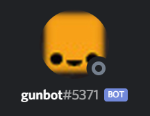

  

BotBall is an event where two robots are put in on a specific game board to win as many points as possible. Each year a new game board is made for a different type of challenge to aquire points using different methods. Each year, a story to the game board is given for the challenge. The game board of the year 2018 had the game with a story of the Botguy, the mascot of Botball, helped improving the agriculture in Oklahoma. The game was to do the same as Botguy did and to improve the agriculture by moving objects from to specific locations on the board and to achieve several challenges throughout the improvment of the agriculture in the limited time given. 

For this project, I was the lead programmer of the team, responsible for programming the movement, detection, and other various programming to allow the bot to achieve the goals of our plan to recieve the most amount of points. I started with the specific movement and timing of the movement of the bot as there was another one of our bot on the game board which was needed to be compensated to not crash into each other. Where routes crossed over and where the bot's needed to help each other were calculated to not mess up one another's movement and to allow the other bot to achieve a certain goal. Then, the basic motor functions were worked on to be able to interact with the enviornment of the game board. The detection was also used and programmed my team.

You can learn more at the [BotBall Website](https://www.kipr.org/botball).

